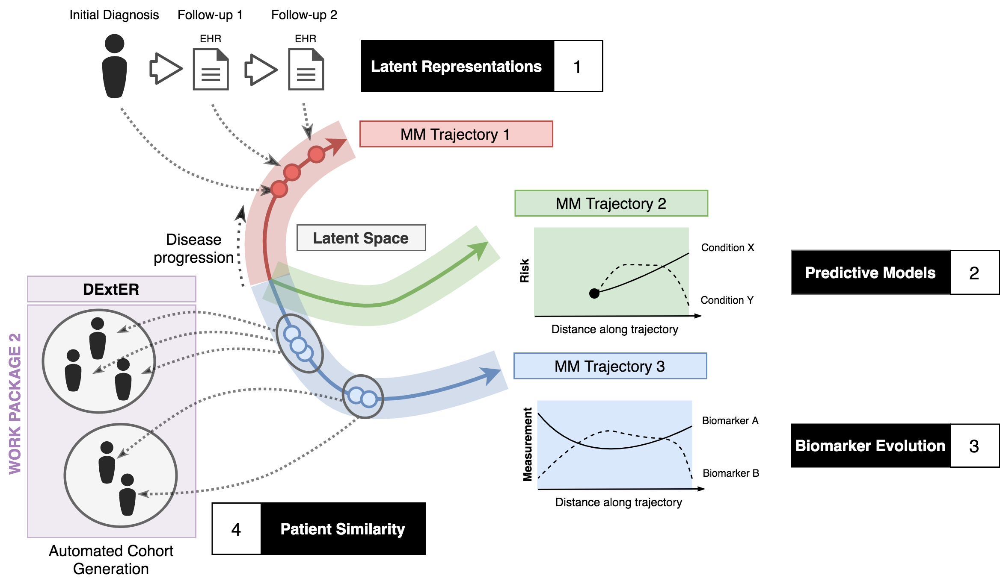
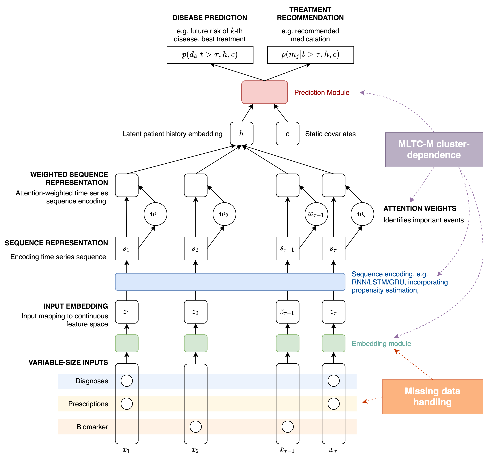

# AIM OPTIMAL

This is a repository for *Work Package 1: Cluster sequences and response to therapies in cMM* of NIHR-funded AIM OPTIMAL project led by University of Birmingham.

## Project Information

- [Team](team.md)
- [Work strands](strands.md)
- [Milestones](milestones.md)

## Objectives

<figure>
  

    
  

  

    <b>Figure 1 - Schematic representation of WP1</b>
  

</figure>

**RQ1:** What are the trajectories of diseases within clusters, including sub-clinical and advanced phenotypes of the disease, measured as a continuum using biomarkers and physiological measurements of disease severity? (**Objective 1**)

**RQ2:** Does choice of prescribed medications reduce or increase risk of development of a subsequent disease or complication of an existing disease? (**Objective 2**)

**RQ3:** Can we develop risk prediction algorithms to allow us to identify: 1) the likely next disease; and 2) the best treatment option where there are multiple choices (e.g. best second line treatment, in diabetes or disease modifying anti-rheumatic drug in rheumatoid arthritis)? (**Objective 3**)

**RQ4:** Do acute clinical expressions (hyperglycaemia, delirium, TIA) and clinical data (increased granularity – features derived from images, electrophysiological findings, laboratory measurements) during hospital admissions and outpatient visits improve the predictive algorithms for future disease accumulation and therapeutic choice? (**Objective 4**)

## Methods

We will adopt a well-founded modelling approach that has recently become popularised for the characterisation of observational electronic medical record data. In such an approach, at any time point, each patient is associated with a “state” which denotes their history of (discrete) disease conditions, prescriptions, and biophysical measurements. These states will only be observed at a finite set of irregularly sampled time points and may be partially observed (e.g. disease conditions recorded but no biomarkers), or contain genuine missing entries (as supposed to measurements that were never taken). They are otherwise latent states which are unobserved. The state of each patient will be assumed to evolve over time according to an unknown law that we will learn from data. These temporal dynamics could be dependent on (near) static (gender, ethnicity) or time-varying (e.g. age, smoking status) covariates. The relative sparsity and irregular sampling of measurements in any individual means we must leverage large populations to infer the properties of these stochastic processes. Furthermore, critically for our work, there may exist different sub-groups (e.g. clusters, ethnic & deprivation groups) of patients that exhibit different time- evolution behaviours (Figure 1).

We will leverage recently developed software implementations that have utilised frameworks and technologies from the field of deep learning to implement such models for the analysis of hospital-based secondary care data and insurance claim information. The critical benefit of these implementations is that we can specify non/semi- parametric models, which are adaptive to data properties, avoiding the need to make strong assumptions about the relationships between variables and the stochastic processes governing their evolution. This allows us to describe potentially complex life course trajectories from multimodal data that cannot be explained using classical linear models. Furthermore, the underlying software frameworks (e.g. Tensorflow, PyTorch) are readily scalable to large datasets and diverse computational environments, minimising the need to create bespoke approaches for model fitting and deployment.

Figure 2 shows a detailed schematic of a solution framework that we will adopt and extend. Here, variable-sized input data points consisting of time-stamped diagnostic and/or prescription codes, together with biomarker measurements are mapped on to a continuous-valued, fixed-sized latent feature vector via neural network-based embedding modules. Previous methods have employed simple linear embedding networks for this purpose but more complex variants can be developed that can explicitly account for missing data. These sequences are then further transformed using a sequence encoder to derive new latent variables that summarise the time-dependent properties, recent examples typically employ the use of recurrent neural networks (RNNs) and specifically long-short term memory (LSTM) units or the simpler GRU units. We will weight these sequence representations using so- called *attention weights* that will allow our models to focus on particular events that might be important for downstream outputs. This has been shown to give models of this type increased interpretability as the attention weights give a measure of significance to particular medical events. Weighted sequence representations can then be encoded into a single latent state that can be utilised alongside other static covariates for predictive purposes by feeding these as inputs into a final predictive output module. Previous examples have used prediction modules that provide disease risk prediction propensity scoring for drug selection or outcome prediction.

<figure>
  

    
  

  

    <b>Figure 2 - Schematic representation of WP1</b>
  

</figure>

