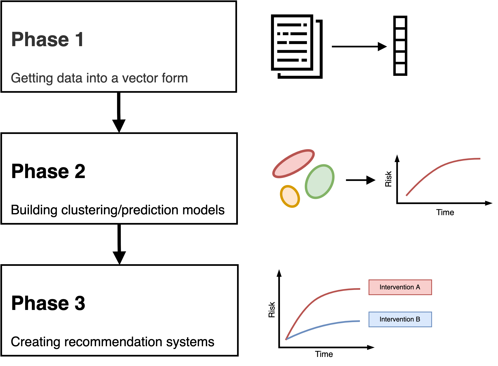

# Work Strands

<figure>
  

    
  

  

    <b>Figure 1 - Methods development phases</b>
  

</figure>

## Phase 1

**Members:** Steven, Dominic

1. **Data access and development cohort generation**
    - Initial CPRD extract (Meeting: 06/10/21)
2. **Linking to clinical questions**
3. **Data exploration** (22/11/21)
    - Missing data
    - Structure
    - Bias
    - Confounders
4. Implementing and benchmarking pre-existing related methods
    - [DeepIPW](https://github.com/ruoqi-liu/DeepIPW)
5. Learning useful representations for Phase 2/3

## Phase 2

**Members:** Dominic, PDRA1, PDRA2

1. Clustering model development
2. Prediction model development
3. Analysis 

## Phase 3

**Members:** PDRA1, PDRA2

1. Recommendation engine development
2. Linking to clinical utility
3. Analysis

