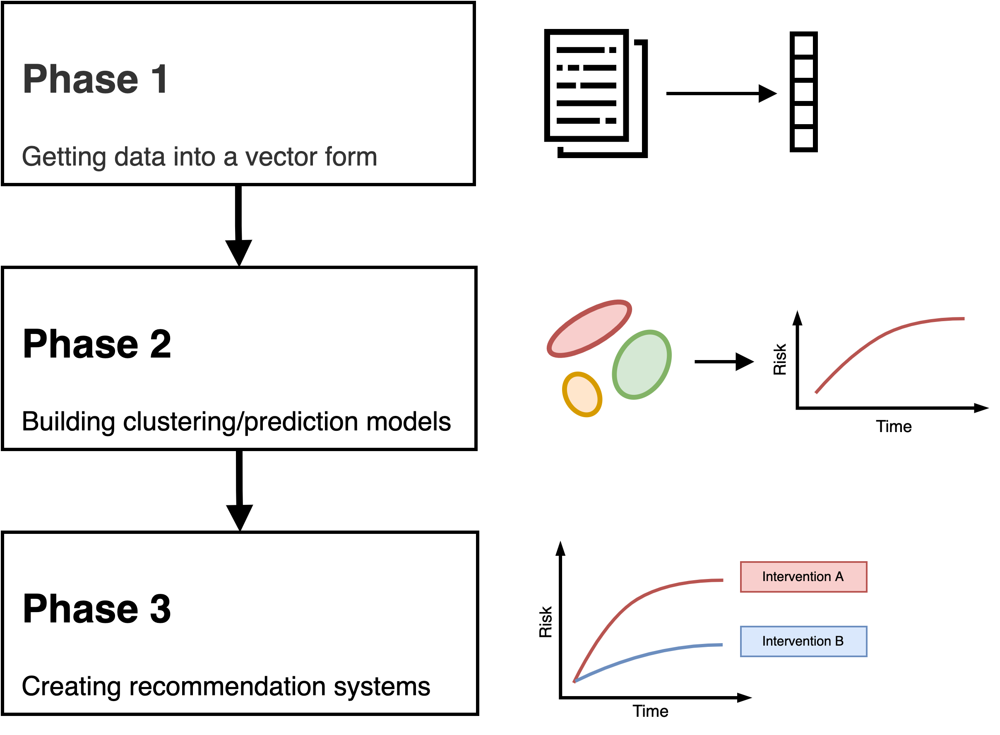

# Work Strands

## Phase 1

1. Data access and development cohort generation
2. Data exploration
  - Missing data
  - Structure
  - Bias
  - Confounders
4. Implementing and benchmarking pre-existing related methods
5. Learning useful representations for Phase 2/3

## Phase 2

1. Clustering model development
2. Prediction model development

## Phase 3

1. Recommendation engine development
